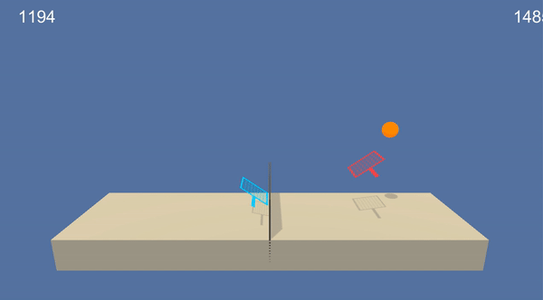
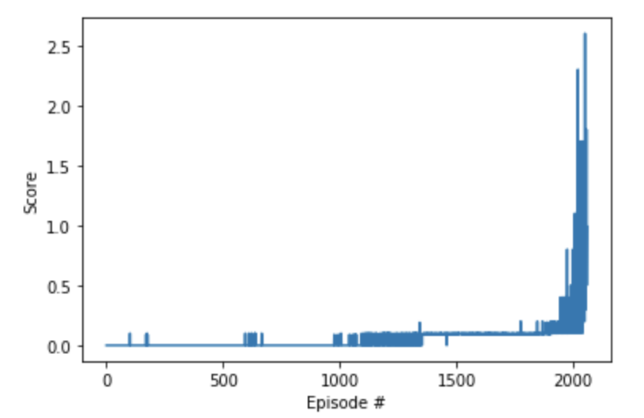

# Report

In solving this challenge I was able to use the same model and agent used in the continuous control environment [here](https://github.com/kelstopper/drl_continuous_control) with some slightly different parameters

## Learning Algorithm

The environment is solved using a DDPG agent. The agent has been amended to allow it to work with multiple agents. The same code can be used to solve both the single agent environment and the multiple agent environment simply by changing the `--filename` passed to the ddqn.py script.

The actor and critic networks are very much the same, in that they both use 3 fully connected layers `fc1_units=256, fc2_units=256` in the case of the multi agent solve and `fc1_units=400, fc2_units=300` in the single agent scenario, the actor  has an output of the action size, in this case `4`. The critic returns a single value.

The agent in turn creates the required number of actor and critic models and stores them in a local variable. The modifications are: when taking a step each agents adds its state to the shared replay buffer and then every 10 steps updates each agent 5 times with a batch of `1024` samples.

Hyperparameters:

```python
BUFFER_SIZE: 1000000
BATCH_SIZE: 128
GAMMA: 0.99
TAU: 0.001
LR_ACTOR: 0.0001
LR_CRITIC: 0.0003
WEIGHT_DECAY: 0
UPDATE_EVERY: 1
UPDATE_TIMES: 1
```

Buffer Size:
1MM may be a bit large in this case but gives us a broad sample size to learn from

Batch Size:
A batch size of 128 worked well for this scenario

Gamma:
Gamma is left higher to train geared towards more immediate rewards.

Tau:
The low tau shifts the prediction models to the target models more gradually

Learning Rates:
Actor: `0.0001` Critic: `0.0003`. This performed well in the first iteration

Weight Decay:
Left at `0` and did not change for this solution

Update Every and Update Times: Rather than in the continuous control project I chose to have the networks update every time.

---

## Rewards - Success!

Results can be seen here: [Notebook](Tennis.ipynb)

`Solved! Episode: 2059, Solved after 1959 episodes! Average score over last 100 episodes: 0.507600007597357`





## Future improvements or research areas

* Play with the hyperparameters, currently it takes ~2500 episodes to gain success. Can this be improved?
* The agents ignore eachothers state, can this be improved to say make a decision based on the other agent?
* Only one agent may be necessary here to make the decisions. Currently this is using two unique based on the code coming from the previous exercise.